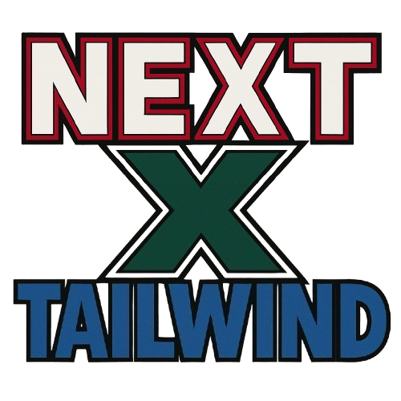

<!-- Logo space -->
<div align="center">
  

  # Next.js + Tailwind Template
  
  A personal template project using Next.js and Tailwind CSS for quick project setup
  
  [](https://nextjs.org/)
  [](https://tailwindcss.com/)
  [](https://www.typescriptlang.org/)
  [](https://bun.sh/)
</div>

## Overview

This is a custom template for quickly bootstrapping web applications using Next.js and Tailwind CSS. It provides a solid foundation for personal projects and can be used by others looking for a streamlined setup.

## Features

- ⚡ **Next.js** - React framework with server-side rendering
- 💨 **Tailwind CSS** - Utility-first CSS framework
- 📝 **TypeScript** - Type safety for your JavaScript
- 🧩 **Components structure** - Organized components directory
- 🪝 **Custom hooks** - Directory for reusable React hooks
- 🛠️ **Setup script** - Automated project initialization with custom naming

## Project Structure

```
project-root/
├── .gitignore
├── biome.json
├── bun.lock
├── components.json
├── next.config.ts
├── package.json
├── postcss.config.mjs
├── README.md
├── setup.sh
├── tsconfig.json
└── src/
    ├── app/
    ├── components/
    ├── hooks/
    ├── lib/
    └── services/
```

## Getting Started

### Prerequisites

- [Bun](https://bun.sh/) (recommended) or [Node.js](https://nodejs.org/)
- Git

### Installation

1. Clone the repository:

```bash
git clone https://github.com/jwar28/next-x-tailwind.git my-project
cd my-project
```

2. Install dependencies:

```bash
bun install
```

3. Make the setup script executable and run it with your project name:

```bash
chmod +x ./setup.sh
./setup.sh <new-project-name>
```

This script will:
- Update the project name in package.json and other configuration files
- Initialize a fresh Git repository
- Set up everything you need to start developing

4. Start the development server:

```bash
bun dev
```

Your application will be available at [http://localhost:3000](http://localhost:3000)

## Customization

### Tailwind Configuration

You can customize the Tailwind configuration in the `tailwind.config.ts` file.

### Project Structure

Feel free to modify the project structure to suit your needs. The current structure provides a good starting point for most applications.

## Deployment

This template can be deployed on various platforms:

- [Vercel](https://vercel.com/) (recommended for Next.js)
- [Netlify](https://www.netlify.com/)
- Any other platform that supports Next.js


## Acknowledgements

- [Next.js](https://nextjs.org/)
- [Tailwind CSS](https://tailwindcss.com/)
- [TypeScript](https://www.typescriptlang.org/)